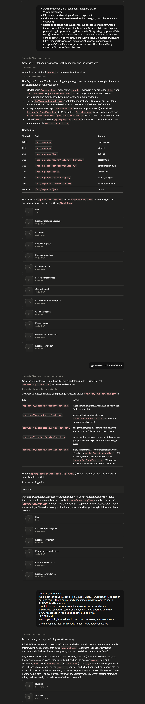

# AI_NOTES.md

This project was built with heavy use of Claude (Anthropic) as a coding assistant. Below is an honest breakdown of what was AI-generated, what I validated/changed, and what I chose not to use.

## 1. AI-generated vs. self-written

**AI-generated (Claude):**

- Entire initial scaffold: `Expense` model, `ExpenseRepository` (in-memory `List`), `ExpenseService`, `FilterExpenseService`, `CalculateService`, `ExpenseController`, and the exception package (`GlobalException`, `ExpenseNotFoundException`, `ErrorResponse`, `GlobalExceptionHandler`).
- `ExpenseRequest` DTO with Bean Validation annotations.
- `pom.xml` and the `@SpringBootApplication` entry point.
- Full test suite: `ExpenseRepositoryTest`, `ExpenseServiceTest`, `FilterExpenseServiceTest`, `CalculateServiceTest`, `ExpenseControllerTest`.
  **Written and directed by me:**

* I defined the original requirements, including the required endpoints and package structure (`services`, `repository`, `exception`, `controller`).
* The following was the prompt I provided to Claude:

```
Create an Expense Tracker REST API with the following features:

- Add an expense (id, title, amount, category, date)
- View all expenses
- Filter expenses by category (search expenses)
- Calculate total expenses:
  - Overall total
  - Category-wise total
  - Monthly summary endpoint
- Delete an expense

Model:

model/Expense.java

package com.diligent.model;

import java.sql.Date;
import lombok.Data;

@Data
public class Expense {
    private Long id;
    private String title;
    private Double amount;
    private String category;
    private Date date;
}

Requirements:
- Use a List for data storage (no database).
- Use the package structure `com.diligent.<...>`.
- Generate the following files:

services/
- ExpenseService.java
- CalculateService.java
- FilterExpenseService.java

repository/
- ExpenseRepository.java

exception/
- GlobalException.java
- Any additional exception classes if required

controller/
- ExpenseController.java
```

## 2. What I validated, tested, or changed — and why

- **Model change:** The `Expense` class I started with only had `id`, `title`, `category`, `date` — no `amount`. Since "amount" is core to an expense tracker (needed for all the total/summary endpoints), I had the AI add it.
- **Date type change:** Switched `date` from `java.sql.Date` to `java.time.LocalDate`. Reasoning: `LocalDate` serializes cleanly to JSON out of the box and makes the monthly-summary grouping (`yyyy-MM`) trivial with `DateTimeFormatter`, whereas `java.sql.Date` is a legacy JDBC-oriented type that's awkward for a no-database, JSON API project.
- Claude don't gave the dependencies to add on the pom.xml file which I add.
- I test all the api endpoints manually on the postman.
- Code given by claude don't have package definitions and folder names correctly as per my folder and file names which I changed.
  s

## 3. AI suggestions I decided not to use — and why

- AI suggested adding Swagger/OpenAPI docs — decided against it to keep the project scoped to the assignment requirements.\_

---


