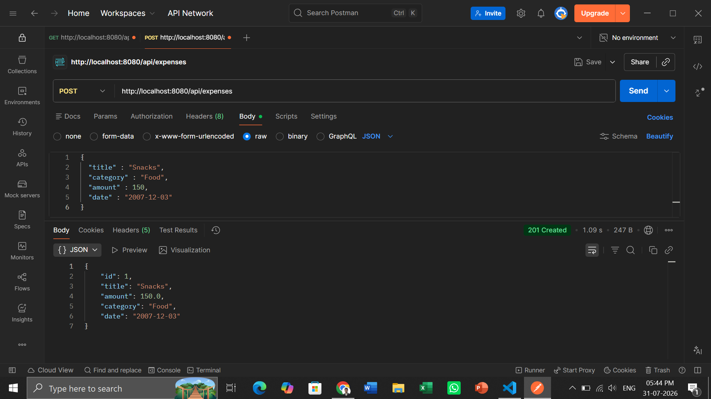
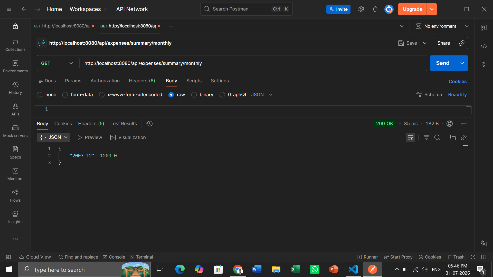
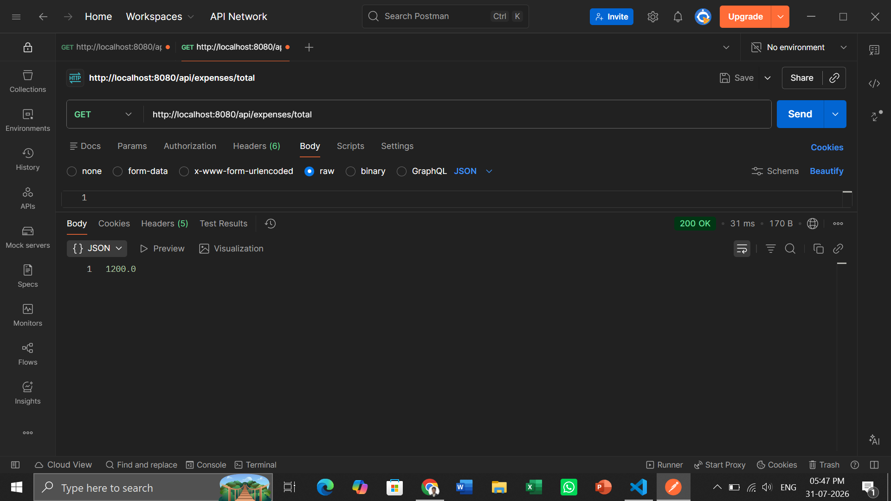
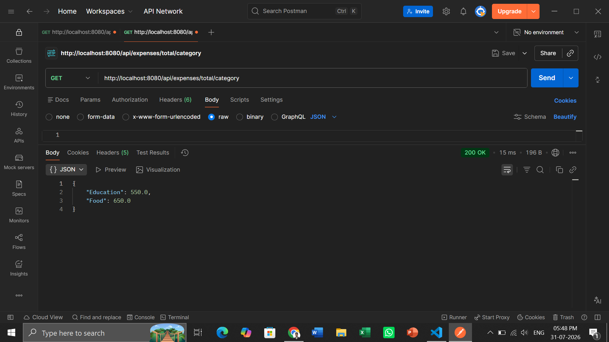
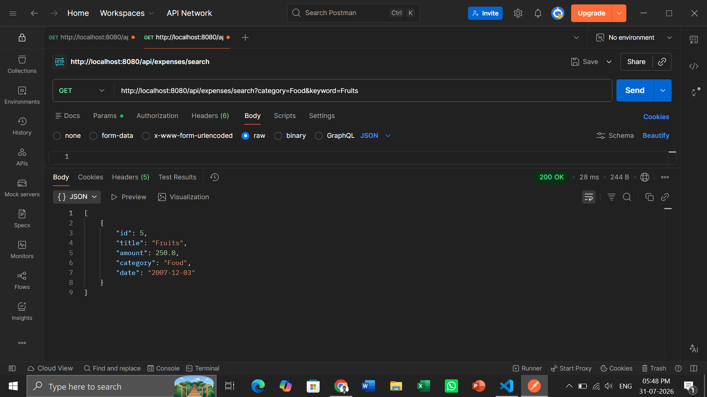
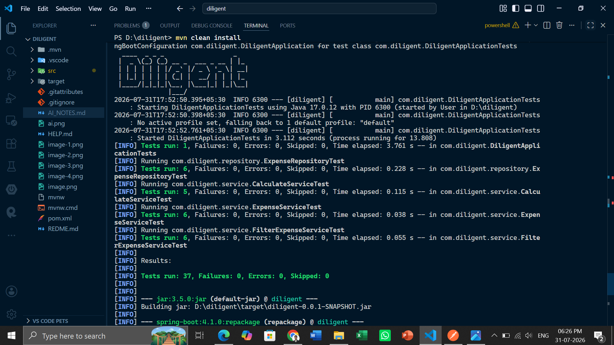

# Expense Tracker API

A simple Spring Boot REST API for tracking personal expenses. Data is stored **in-memory** (a `List` inside a repository class) — no database required.

## Features

- Add an expense (`id`, `title`, `amount`, `category`, `date`)
- View all expenses
- Filter expenses by category / search by title keyword
- Calculate total expenses (overall, by category, and monthly summary)
- Delete an expense

## Tech Stack

- Java 17
- Spring Boot 3.3 (Web, Validation)
- Lombok
- Maven
- JUnit 5, Mockito, MockMvc, AssertJ (testing)

## Project Structure

```
src/main/java/com/diligent/
├── ExpenseTrackerApplication.java
├── controller/
│   └── ExpenseController.java
├── services/
│   ├── ExpenseService.java
│   ├── FilterExpenseService.java
│   └── CalculateService.java
├── repository/
│   └── ExpenseRepository.java
├── dto/
│   └── ExpenseRequest.java
├── model/
│   └── Expense.java
└── exception/
    ├── ExpenseNotFoundException.java
    ├── GlobalException.java
    ├── ErrorResponse.java
    └── GlobalExceptionHandler.java

src/test/java/com/diligent/
├── repository/ExpenseRepositoryTest.java
├── services/ExpenseServiceTest.java
├── services/FilterExpenseServiceTest.java
├── services/CalculateServiceTest.java
└── controller/ExpenseControllerTest.java
```

## Installation

**Prerequisites:** Java 17+ and Maven 3.6+ installed.

```bash
git clone <your-repo-url>
cd expense-tracker
```

No database setup needed — everything runs in-memory.

## Running the Server

```bash
mvn spring-boot:run
```

The API will start on `http://localhost:8080`.

Alternatively, build a jar and run it directly:

```bash
mvn clean package
java -jar target/expense-tracker-0.0.1-SNAPSHOT.jar
```

## Running Tests

```bash
mvn test
```

This runs all unit and MockMvc-based controller tests (repository, services, and controller layers).

## API Endpoints

| Method | Endpoint                                  | Description                                    |
| ------ | ----------------------------------------- | ---------------------------------------------- |
| POST   | `/api/expenses`                           | Add a new expense                              |
| GET    | `/api/expenses`                           | View all expenses                              |
| GET    | `/api/expenses/{id}`                      | Get a single expense by id                     |
| GET    | `/api/expenses/search?category=&keyword=` | Search/filter by category and/or title keyword |
| GET    | `/api/expenses/category/{category}`       | Strict filter by category                      |
| GET    | `/api/expenses/total`                     | Overall total of all expenses                  |
| GET    | `/api/expenses/total/category`            | Total grouped by category                      |
| GET    | `/api/expenses/summary/monthly`           | Monthly summary (`yyyy-MM` → total)            |
| DELETE | `/api/expenses/{id}`                      | Delete an expense by id                        |

### Sample request body (POST `/api/expenses`)

```json
{
  "title": "Coffee",
  "amount": 5.0,
  "category": "Food",
  "date": "2026-07-01"
}
```

## Screenshots

Add your screenshots here, e.g.:

### Adding an expense (Postman)



### Monthly summary response



### Total Expesnses



### Total by category



### Search/Filter By category



### Test run output


